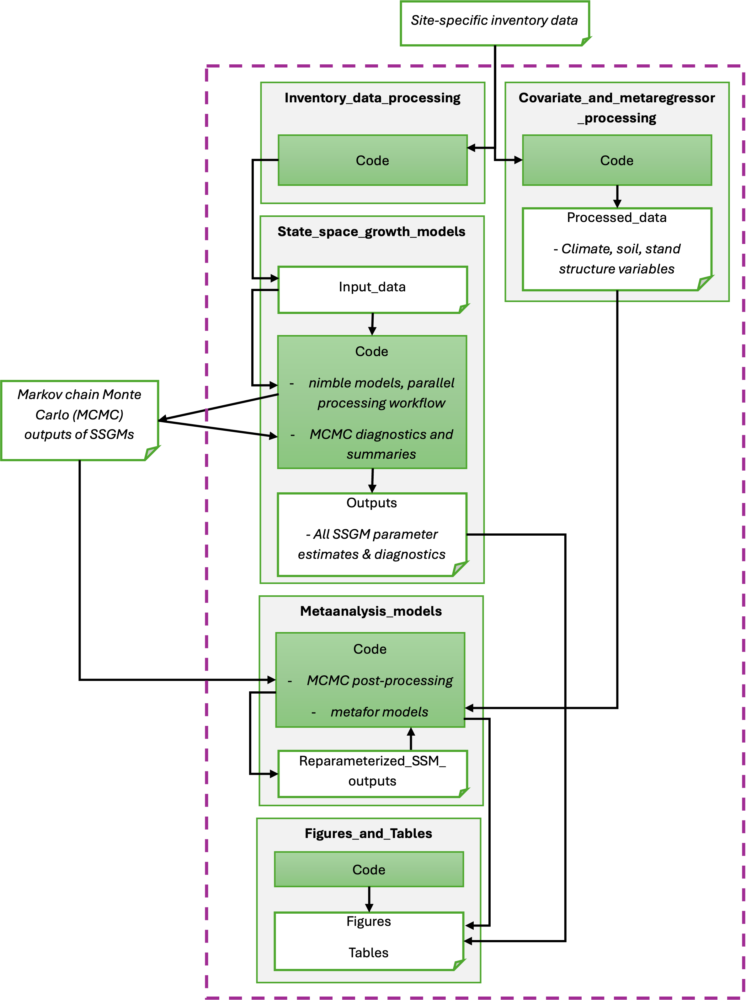

# Meta-analysis of tree growth responses to fuel reduction treatments across Sierra Nevada mixed-conifer forests

This repository contains code used to generate the results, figures, and tables in the article "Tree growth varies with fuel treatment type, tree size, and climate in Sierra Nevada mixed conifer forests" by Jessica R. Katz, Perry de Valpine, Alice Cima, John J. Battles, Adrian J. Das, Eric E. Knapp, Kathryn E. Low, Patricia N. Manley, Malcolm P. North, Polly C. Thornton, Angela M. White, and Lara M. Kueppers.

For any questions, please contact Jessica Katz (jessica_katz@berkeley.edu).

## Citation
[Placeholder]

## Overview
In this study, we compiled and analyzed data from seven field experiments and continuous forest inventories to synthesize tree growth responses to mechanical thinning and prescribed burning across the geographically- and climatically-diverse Sierra Nevada mixed-conifer (SNMC) forests of California. The analysis consists of multiple components, each represented by a folder in this repository: 1) processing forest inventory data; 2) processing covariate and meta-regressor data; 3) estimating 19 state-space models of tree growth (each model specific to a unique combination of plant functional type [PFT] and site); 4) using mixed-effects meta-analysis and meta-regression to estimate pooled effects across sites; and 5) producing figures and tables for the publication. 

The seven sites included in this analysis include:

* “Blodgett:” The Fire and Fire Surrogate Studies located at Blodgett Forest Research Station (Stephens and Moghaddas 2005);
* "LaTour:" The Continuous Forest Inventory program at LaTour Demonstration State Forest (Ritchie and Withrow, Jr. 1964);
* "Sequoia:" The Fire and Fire Surrogate Studies located at Sequoia National Park (Knapp et al. 2005);
* "STEF:" The Variable Density Thinning Experiment at Stanislaus-Tuolumne Experimental Forest (Knapp et al. 2017); 
* "Teakettle:" The Teakettle Ecosystem Experiment (North et al. 2002); 
* "Tharp's Creek:" A prescribed fire study located in the Tharp’s Creek and Log’s Creek watersheds of Sequoia National Park (Mutch and Parsons 1998); and 
* “W. Lake Tahoe:” A thinning study located in West Lake Tahoe (Low et al. 2021).

The figure below illustrates the components of this repository and our general workflow. For a detailed description of the study and methods, see Katz et al. ([placeholder]). Due to the large size of the Markov chain Monte Carlo outputs of the state-space growth models (SSGMs), we do not include these outputs in the repository. However, they can be reproduced by running the code within the "State_space_growth_models" folder.   

### Forest inventory data availability
We do not include forest inventory data inputs within this repository. Where needed, the code contained in this archive links to other external data archives. 

For Blodgett, raw inventory data are available at [Stephens et al. 2025](https://doi.org/10.6073/pasta/06a3a2556f5289b89b9f8683becfe08e). For Sequoia and Tharp's Creek, raw inventory are available at (placeholder). In both of these cases, we provide the code needed to convert the raw data to SSGM inputs in the "Inventory_data_processing" folder of this repository.

For the other four sites (LaTour, STEF, Teakettle, and W. Lake Tahoe), state-space model inputs are archived at (placeholder).

## Contents
### Inventory_data_processing
Contains code for processing raw inventory data to create the inputs needed to run the SSGMs. Key processes include: data cleaning (removing duplicated, null, and filled records; harmonizing tree species and life status across each tree’s remeasurements; and correcting typos); removing trees with less than two post-treatment diameter at breast height (DBH) measurements or with DBH < 15cm; removing remeasurements on dead trees; removing DBH remeasurements associated with growth outliers; and formatting data tables for SSGM ingestion. 

We provide processing scripts only for sites with permanently archived inventory data (i.e., Blodgett).

* `Code/`
  + `config.py`: provides values and list-style mappings to enable consistent data processing (e.g., consistent treatment naming convention and minimum diameter threshold) across all sites. 
  + `inventory_processing_functions.py`: provides all common functions needed to process inventory data for each site. These functions are called in `process_inventory_data_*Blodgett*.ipynb` and `get_stanStructure_*.ipynb` notebooks.
  + `process_inventory_data_Blodgett.ipynb`: pipeline for processing raw inventory data [(Stephens et al. 2025)](https://doi.org/10.6073/pasta/06a3a2556f5289b89b9f8683becfe08e) and producing SSGM input data for Blodgett (other sites use a similar process). Saves processed data to `State_space_growth_models/Input_data/Blodgett/`.
  
### Covariate_and_metaregressor_processing
Contains code for processing the climatic water deficit (CWD) covariate in the SSGM and the mean climate, soil, and stand structure meta-regressors. Also contains the resulting data files.

* `Code/`
  + `covariate_functions.py`: contains functions for associating the geospatial coordinates of treatment units with raw covariate and/or meta-regressor data. 
  + `process_terraclimate_data.R`: takes in raw data from Terraclimate (which must be downloaded separately); shifts calendar year to climate year and aggregates each climate variable (winter precipitation, CWD, Palmer Drought Severity Index [PDSI]) from monthly to annual. Outputs the `*_by_waterYr.nc` netCDF files.
  + `get_CWD_timeseries_for_SSM.ipynb`: takes in the output of `process_terraclimate_data.R` and extracts the CWD timeseries associated with each tree within each site. Produces the `cwd_tree_year.csv` file (one of the inputs to the SSGM) for one or more sites. 
  + `create_climate_metaregressors.ipynb`: takes in the output of `process_terraclimate_data.R` and calculates the winter precipitation, CWD, and Palmer Drought Severity Index (PDSI) metaregressor for each treatment unit within each site. Outputs `site_mean_clim.csv`.
  + `process_ssurgo_variables.R`: adapts the workflow of [Chasen 2020](https://rpubs.com/emchasen/SSURGOcleaning) to import and clean soil survey (SSURGO) data for each survey area in which a study site falls. Outputs `all_unit_soils.csv`.
  + `create_soil_metaregressors.ipynb`: takes in the output of `process_ssurgo_variables.R` and other SSURGO data (which must be downloaded and saved) and calculates the available water capacity (AWC) and soil depth meta-regressors for each treatment unit within each site. Outputs `unit_mean_soil.csv`. 
  + `get_standStructure_Blodget.ipynb`: creates relative stand density index (rSDI) and treatment intensity metaregressors for each treatment unit at Blodgett, using raw inventory data [(Stephens et al. 2025)](https://doi.org/10.6073/pasta/06a3a2556f5289b89b9f8683becfe08e) as input. Creates `Blodgett_intensity.csv`, `Blodgett_rsdi.csv`, and `Blodgett_pretrt_comp.csv`. Other sites use a similar process. 
  + `compile_all_metaregressors.ipynb`: takes in the outputs of `create_climate_metaregressors.ipynb`, `create_soil_metaregressors.ipynb`, and site-specific stand structure processing scripts (e.g., `get_standStructure_Blodget.ipynb`) and compiles all meta-regressors for all sites into one table. Outputs `Covariate_and_metaregressor_processing/Processed_data/all_regressors_by_unit.csv`. 
* `Processed_data/`:
  + `all_regressors_by_unit.csv`: Tabular output of `compile_all_metaregressors.ipynb`, containing unit-specific cliamte, soil, and stand structure meta-regressors for all sites. 
  + `Climate/`
    - `*_by_waterYr.nc`: NetCDF outputs of `process_terraclimate_data.R`, providing gridded values of winter precipitation ("ppt"), CWD, and PDSI for each water year.
    - `site_mean_clim.csv`: tabular output of `create_climate_metaregressors.ipynb`, containing estimates of each climate variable for all sites.
  + `Soil/`:
    - `all_unit_soils.csv`: tabular output of `process_ssurgo_variables.R`, containing estimates of soil depth and AWC for each SSURGO map unit.
    - `unit_mean_soil.csv`: tabular output of `create_soil_metaregressors.ipynb`, containing treatment unit estimates of soil depth and AWC for all sites. 
  + `Stand_structure/`
    - `*_intensity.csv`: percent reduction in basal area between the first post-treatment and last pre-treatment measurement for each treatment unit within the site identified in the filename.
    - `*_rdsi.csv`: estimated SDI, site-specific maximum SDI, and rSDI for each treatment unit within the site identified in the filename. 
    - `*_pretrt_comp.csv`: species fraction of the pre-treatment basal area (trees >=15cm) of each treatment unit within the site identified in the filename. 
  
## State_space_growth_models
Contains the code needed to run site- and PFT-specific SSGMs (in parallel if needed) and run diagnostics on the resultant Markov chain Monte Carlo (MCMC) outputs. 

* `Code/`
  + `scripts_for_parallel_processing`: contains the files needed to run multiple SSGMs in parallel.
    - `parallel_ss_cores.sh`: shell script that sets up and dispatches the parallel SSGM model runs. It will run a SSGM for each combination of site, PFT, and model given in the three `.lst` files within this sub-folder.
    - `args_ssm.sh`: shell script that calls `State_space_growth_models/Code/run_ssm.R` with the arguments passed from `parallel_ss_cores.sh` and renames the log file.
    - `pft.lst`: list of PFTs (e.g., cedar, fir, yellow_pine, white_pine) for which to run SSGMs. 
    - `site.lst`: list of sites (e.g., Blodgett, Latour, STEF) for which to run SSGMs. Site names must be among the sub-folder names in `State_space_growth_models/Input_data`. 
    - `model.list`: list of models (i.e., file names within `State_space_growth_models/Code/nimble_models`) for which to run SSGMs. 
    - `config_c1.R` and `config_c2.R`: R scripts with lists that configure each SSGM for the first and second MCMC chains, respectively. User may edit the MCMC thinning interval and number of iterations for each site- and PFT-specific SSGM. 
  + `nimble_models`: contains different SSGM formulations using the nimble packages in R.
    - `ddbh_model.R`: default state-space model for tree growth (corresponds to Equations 1-4 in Katz et al. (placeholder)).
    - `ddbh_model_TreePrior.R`: modification of `ddbh_model.R` to set an informative prior for the standard deviation on the tree random effect. Used only for the W. Lake Tahoe SSGMs.
    - `ddbh_model_UnitPrior.R`: modification of `ddbh_model.R` to set an informative prior for the standard deviation on the unit (plot) random effect. Used only for the Sequoia and Tharp's Creek SSGMs.
  + `ssm_config.R`: defines file paths for inputs and outputs of SSGMs. 
  + `process_inputs.R`: takes in data from the `State_space_growth_models/Input_data` subfolders and creates the data and constant variables needed to create the nimble model for a given site and PFT. 
  + `ssm_restart_functions.R`: functions written by [Daniel Turek](https://danielturek.github.io/public/saveMCMCstate/saveMCMCstate.html) that allow a nimble model's internal states to be saved. These saved states can be reloaded into the nimble model to restart it where it left off (which needs to be done for very long chains during which one or more R sessions are terminated before the MCMC has converged).
  + `run_ssm.R`: takes in arguments passed by the shell scripts in `scripts_for_parallel_processing/` and either starts or restarts an SSGM for a given site and PFT, configured using ``scripts_for_parallel_processing/config_*.R` depending on the chain. Calls `create_ssm_diagnostics.R` after the run has completed. 
  + `ssm_functions.R`: provides a set of functions needed to process the MCMC outputs of an SSGM.
  + `create_ssm_diagnostics.R`: creates an html document with figures and tables useful for observing and diagnosing the progress of the MCMCs produced by an SSGM. Summarizes details across multiple runs of the same chain; creates traceplots; summarizes parameter estimates; plots observed and modeled growth for a set of random trees; and calculates the effective sample size for each parameter.
  + `batch_ssm_diagnostics.R`: Loops through all SSGMs in the list of completed models (e.g., `State_space_growth_model_Outputs/authors_complete_models.RData`), applies the specified burn-in for each SSGM, and creates and saves final SSM diagnostic figures and parameter estimates for each SSGM.
  + `convergence_diagnostics_one_model.R`: Gets Gelman-Rubin diagnostics for two chains of the same SSGM.
  + `batch_convergence_diagnostics.R`: Loops through all SSGMs in the list of completed models (e.g., `State_space_growth_model_Outputs/authors_complete_models.RData`) and compiles Gelman-Rubin statistics for all parameters.
  + `make_convergence_diagnostic_table.R`: Reads the csv produced by `batch_convergence_diagnostics.R` and creates a summary table of Gelman-Rubin statistics (Table S5). 
  + `compile_ssm_params.R`: Loops through all  SSGMs in the list of completed models (e.g., `State_space_growth_model_Outputs/authors_complete_models.RData`) and compiles the final parameter estimates into one dataframe, saved as `State_space_growth_model_Outputs/allParams_[date].csv`.
  + `summarize_parameter_estimates`: Reads the csv produced by `compile_ssm_params.R` and creates Tables S6-S7 and Figure S8, summarizing parameter estimates from each SSGM.
* `Outputs/`: 
  + `allParams_2025-12-02.csv`: Tabular output of `compile_ssm_params.R`, summarizing parameter estimates for each site- and PFT-specific SSGM.
  + `authors_complete_models.RData`: R data object containing the final list of models (specified by site, PFT, and model), along with burn-in values, included in Katz et al. (placeholder). Users should create their own version of this object for their own analyses.
  + `runs_to_concatenate_c*.RData`: R data object providing a structure in which to store the lists of MCMC run names associated with SSGM. The filename indicates the chain (c1=chain 1; c2 = chain 2) associated with the runs. These files are automatically updated when SSGMs are run via `run_ssm.R`. 
  + `runs_to_concatenate_template.R`: R script providing a template to create a new, blank version of `runs_to_concatenate_c*.RData`. 
  
## Metaanalysis_models
Contains the code needed to post-process outputs of the SSGMs and estimate all meta-analysis and meta-regression models.

* `Code/`
  + `metaanalysis_config.R`: Defines study-wide significance thresholds, meta-regressors, and other inputs to meta-analyses and meta-regressions.
  + `metaanalysis_functions.R`: Suite of functions that are used to run meta-analyses and meta-regressions.
  + `postprocess_fixed_effects.R`: Loops through all  SSGMs in the list of completed models (e.g., `State_space_growth_model_Outputs/authors_complete_models.RData`) and reparameterizes the posterior distributions for DBH = 30 cm and CWD = 0. Outputs unit-level estimates of growth (`Metaanalysis_models/Reparameterized_SSM_outputs/unit_growth_effects_by_trt_*.csv`) and site-level parameter estimates for log(DBH) and CWD under each treatment (`Metaanalysis_models/Reparameterized_SSM_outputs/fixed_effects_by_trt_*.csv`), as well as the variance-covariance matrices for each of these outputs (*.RData files). 
  + `postprocess_unit_growth_CWD_DBH.R`: Loops through all  SSGMs in the list of completed models (e.g., `State_space_growth_model_Outputs/authors_complete_models.RData`), a list of DBH values, and a list of CWD values, and reparameterizes the SSGM posterior distributions for each combination of DBH and CWD. Outputs `Metaanalysis_models/Reparameterized_SSM_outputs/growthOutcomesByCWDandDBH*`, including growth outcomes by treatment (.csv file) and variance-covariance matrices (.RData file).
  + `get_pooled_effects.R`: Takes in the outputs of `postprocess_fixed_effects.R`. Runs meta-analyses and makes Figure 2 and Supplementary Tables S8-S10 (Pooled effects of treatment, tree size, measurement period climatic water 
## deficit (CWD), and their interactions on tree growth). 
  + `calculate_trt_effects_by_CWD_DBH.R`: Takes in the outputs of `postprocess_unit_growth_CWD_DBH.R` and runs meta-analyses of treatment effects on growth for different combinations of PFT, DBH, and CWD. Makes Figures 3, 4, and 5.
  + `run_metaregressions.R`: Runs meta-regressions for mean climate, soil, and stand structure variables. Makes Table 2, Figures S9-S15, and Tables S11-21. 
* `Reparameterized_SSM_outputs/`:
  + `unit_growth_effects_by_trt_2025-12-09.csv`: Tabular output of `postprocess_fixed_effects.R`, containing estimates of growth in each treatment unit based on SSGM posterior distributions re-parameterized for DBH = 30 and CWD = 0.
  + `cov_unit_growth_by_trt_2025-12-09.RData`: R data object output of `postprocess_fixed_effects.R`, containing variance-covariance matrices for growth in each treatment unit based on SSGM posterior distributions re-parameterized for DBH = 30 and CWD = 0.
  + `fixed_effects_by_trt_2025_12_09.csv`: Tabular output of `postprocess_fixed_effects.R`, containing estimates of growth and the log(DBH) and CWD effects by treatment for each site.
  + `cov_cwd_by_trt_2025-12-09.RData`: R data object output of `postprocess_fixed_effects.R`, containing variance-covariance matrices for the CWD effects by treatment for each site.
  + `cov_size_by_trt_2025-12-09.RData`:  R data object output of `postprocess_fixed_effects.R`, containing variance-covariance matrices for the tree size (log DBH) effects by treatment for each site.
  + `growthOutcomesByCWDAndDBH.csv`: Tabular output of `postprocess_unit_growth_CWD_DBH.R`, containing estimates of growth in each treatment unit based on SSGM posterior distributions re-parameterized for each combination of DBH and CWD.
  + `growthOutcomesByCWDAndDBH.RData`: R data object output of `postprocess_unit_growth_CWD_DBH.R`, containing variance-covariance matrices for growth in each treatment unit based on SSGM posterior distributions re-parameterized for each combination of DBH and CWD.

## Figures_and_Tables
Contains figures and tables included in the manuscript, and Code to make supplementary figures and tables not produced elsewhere in this repository.

* `Code/`
  + `plotting_config.R`: Specifies values used in creating tables and graphics, including colors, styles, ordering, and naming conventions.
  + `plotting_functions.R`: Suite of functions used specifically for making figures and tables.
  + `make_site_map.R`: Creates Figure 1 (map of study sites).
  + `make_metaregressor_boxplots.R`: Creates Figures S1-S3 (scatterplots and boxplots of meta-regressors).
  + `make_composition_barchart.R`: Creates Figure S4 (pre-treatment species composition by site).
  + `characterize_PFTs_across_sites.R`: Creates Table S1 (number of trees and observations per PFT and site) and Figure S5 (distribution of post-treatment PFT sizes at each site).
  + `make_metaregressor_corrplot.R`: Creates Figure S7 (correlation plot of meta-regressors).
* `Figures/`: contains jpeg objects, with filenames corresponding to Figure numbers in Katz et al. (placeholder).
* `Tables/`: contains csv files, with filenames corresponding to Table numbers in Katz et al. (placeholder).
  

## References
Knapp, E. E., J. E. Keeley, E. A. Ballenger, and T. J. Brennan. 2005. “Fuel Reduction and Coarse Woody Debris Dynamics with Early Season and Late Season Prescribed Fire in a Sierra Nevada Mixed Conifer Forest.” Forest Ecology and Management 208 (1): 383–97. https://doi.org/10.1016/j.foreco.2005.01.016.

Knapp, E. E., J. M. Lydersen, M. P. North, and B. M. Collins. 2017. “Efficacy of Variable Density Thinning and Prescribed Fire for Restoring Forest Heterogeneity to Mixed-Conifer Forest in the Central Sierra Nevada, CA.” Forest Ecology and Management 406: 228–41. https://doi.org/10.1016/j.foreco.2017.08.028.

Low, K. E., B. M. Collins, A. A. Bernal, et al. 2021. “Longer-Term Impacts of Fuel Reduction Treatments on Forest Structure, Fuels, and Drought Resistance in the Lake Tahoe Basin.” Forest Ecology and Management 479: 118609. https://doi.org/10.1016/j.foreco.2020.118609.

Mutch, L. S., and D. J. Parsons. 1998. “Mixed Conifer Forest Mortality and Establishment Before and After Prescribed Fire in Sequoia National Park, California.” Forest Science 44 (3): 341–55. https://doi.org/10.1093/forestscience/44.3.341.

North, M. P., B. Oakley, J. Chen, et al. 2002. Vegetation and Ecological Characteristics of Mixed-Conifer and Red Fir Forests at the Teakettle Experimental Forest. U.S. Department of Agriculture, Forest Service, Pacific Southwest Research Station. https://www.fs.fed.us/psw/publications/documents/psw_gtr186/.

Ritchie, R. W., and R. N. Withrow, Jr. 1964. Latour State Forest Continuous Forest Inventory Plan: Field Instructions. State of California, The Resources Agency, Department of Conservation, Division of Forestry.

Stephens, S. L., and J. J. Moghaddas. 2005. “Experimental Fuel Treatment Impacts on Forest Structure, Potential Fire Behavior, and Predicted Tree Mortality in a California Mixed Conifer Forest.” Forest Ecology and Management 215 (1): 21–36. https://doi.org/10.1016/j.foreco.2005.03.070.

Stephens, S. L., R. A. York, A. Roughton, J. J. Battles, and B. M. Collins. 2025. “The Fire and Fire Surrogate Study: Berkeley Forests 2001-2020.” Edi. 2104.1. Version 1. Environmental Data Initiative, August 12. https://doi.org/10.6073/pasta/06a3a2556f5289b89b9f8683becfe08e.
